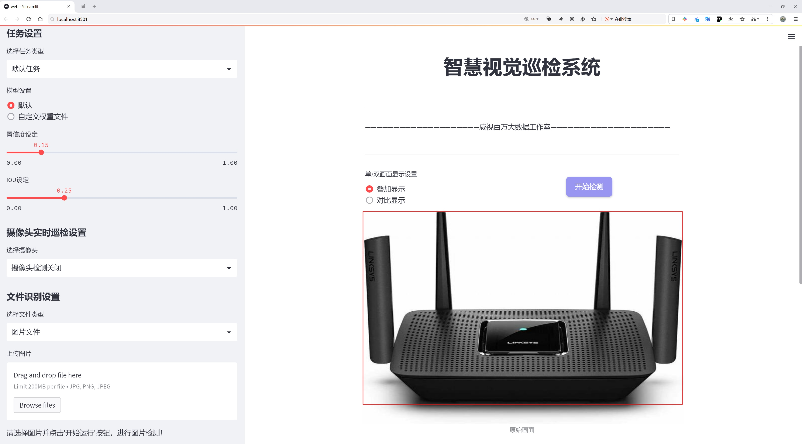
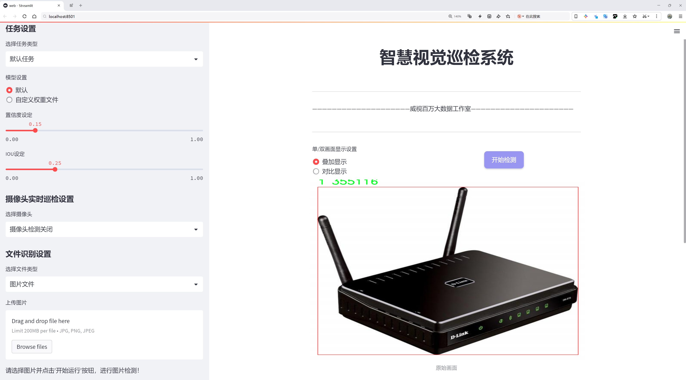
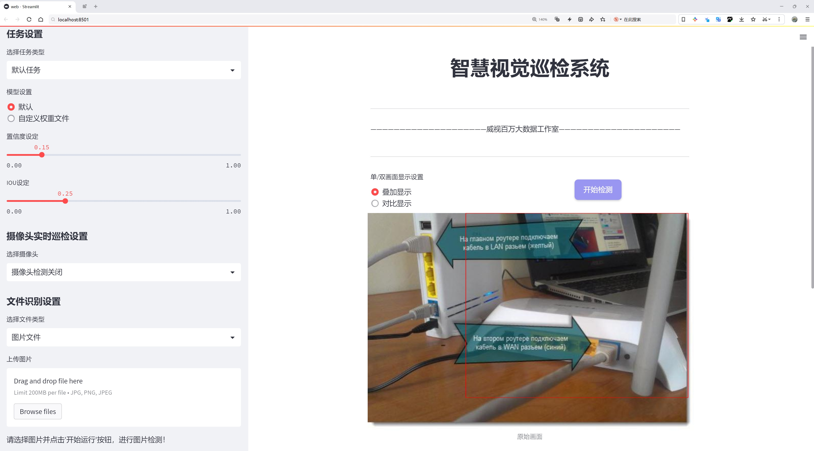
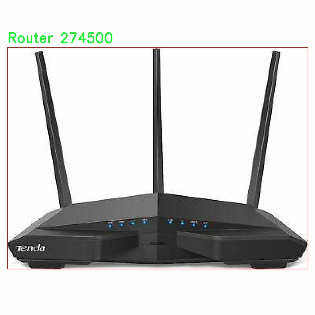
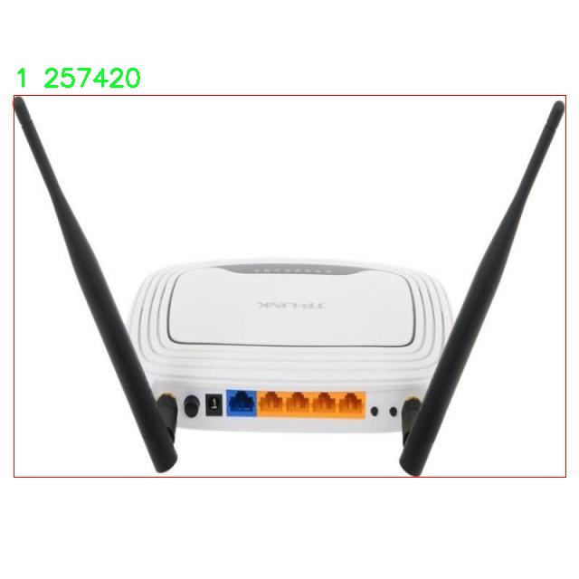
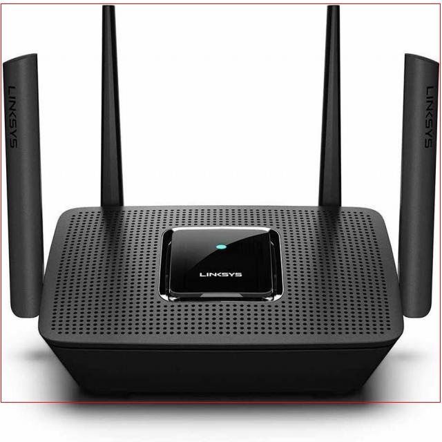
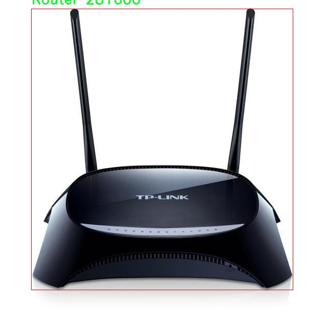
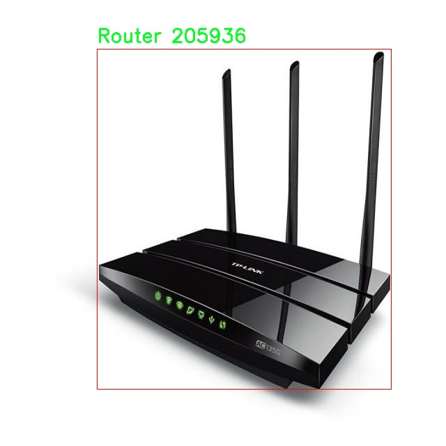

# 通讯运营商设备类型检测系统源码分享
 # [一条龙教学YOLOV8标注好的数据集一键训练_70+全套改进创新点发刊_Web前端展示]

### 1.研究背景与意义

项目参考[AAAI Association for the Advancement of Artificial Intelligence](https://gitee.com/qunmasj/projects)

项目来源[AACV Association for the Advancement of Computer Vision](https://github.com/qunshansj/good)

研究背景与意义

随着信息技术的迅猛发展，通讯运营商在网络基础设施建设中扮演着至关重要的角色。尤其是在智能城市和物联网（IoT）等新兴领域，通讯设备的种类和数量不断增加，如何高效地管理和维护这些设备成为了一个亟待解决的问题。传统的设备管理方式往往依赖人工识别和分类，不仅效率低下，而且容易出现误判，影响网络的稳定性和安全性。因此，基于计算机视觉的自动化设备识别与分类技术应运而生，成为提升通讯运营商设备管理效率的重要手段。

在众多计算机视觉技术中，YOLO（You Only Look Once）系列模型因其高效的实时目标检测能力而受到广泛关注。YOLOv8作为该系列的最新版本，进一步提升了检测精度和速度，适用于各种复杂场景下的目标识别。然而，针对特定行业需求，尤其是通讯运营商设备的类型识别，YOLOv8仍然存在一定的局限性。为了更好地满足实际应用需求，改进YOLOv8模型以适应通讯设备的特征，将成为本研究的核心目标。

本研究将基于“cctv1-router-camera”数据集进行YOLOv8模型的改进与优化。该数据集包含2128张图像，涵盖了四类设备：CCTV、Router等，具有较高的代表性和实用性。通过对该数据集的深入分析，我们可以识别出不同设备在外观、形状和功能上的特征，从而为模型的改进提供数据支持。尤其是在设备数量日益增加的背景下，准确识别和分类这些设备将极大地提高通讯运营商的工作效率，降低运营成本。

本研究的意义不仅在于技术层面的创新，更在于其对行业实践的深远影响。通过改进YOLOv8模型，我们能够实现对通讯设备的自动化识别和分类，进而为设备的监控、维护和管理提供科学依据。这将有效提升通讯运营商在设备管理方面的智能化水平，推动行业向数字化、智能化转型。同时，研究成果也可为其他领域的设备识别提供借鉴，促进计算机视觉技术的广泛应用。

此外，随着5G、物联网等新兴技术的推广，通讯设备的种类和复杂性将进一步增加，传统的管理方式将难以适应未来的发展需求。因此，基于改进YOLOv8的通讯运营商设备类型系统的研究，不仅具有重要的学术价值，也具备广泛的应用前景。通过实现设备的智能识别与分类，我们将为通讯运营商提供更加高效、可靠的管理工具，助力其在激烈的市场竞争中占据优势地位。

综上所述，本研究在理论与实践层面均具有重要意义，期待通过对YOLOv8的改进，为通讯运营商的设备管理提供新的解决方案，推动行业的技术进步与发展。

### 2.图片演示







##### 注意：由于此博客编辑较早，上面“2.图片演示”和“3.视频演示”展示的系统图片或者视频可能为老版本，新版本在老版本的基础上升级如下：（实际效果以升级的新版本为准）

  （1）适配了YOLOV8的“目标检测”模型和“实例分割”模型，通过加载相应的权重（.pt）文件即可自适应加载模型。

  （2）支持“图片识别”、“视频识别”、“摄像头实时识别”三种识别模式。

  （3）支持“图片识别”、“视频识别”、“摄像头实时识别”三种识别结果保存导出，解决手动导出（容易卡顿出现爆内存）存在的问题，识别完自动保存结果并导出到tempDir中。

  （4）支持Web前端系统中的标题、背景图等自定义修改，后面提供修改教程。

  另外本项目提供训练的数据集和训练教程,暂不提供权重文件（best.pt）,需要您按照教程进行训练后实现图片演示和Web前端界面演示的效果。

### 3.视频演示

[3.1 视频演示](https://www.bilibili.com/video/BV1ZspbeZE56/)

### 4.数据集信息展示

##### 4.1 本项目数据集详细数据（类别数＆类别名）

nc: 4
names: ['0', '1', 'CCTV', 'Router']


##### 4.2 本项目数据集信息介绍

数据集信息展示

在现代通讯网络的快速发展中，设备类型的准确识别对于网络管理和维护至关重要。为此，我们构建了一个名为“cctv1-router-camera”的数据集，旨在为改进YOLOv8模型提供高质量的训练数据。该数据集专注于四种设备类型的识别，分别是“0”、“1”、“CCTV”和“Router”。通过对这些设备的准确分类，研究人员能够提升网络监控和管理的智能化水平，从而优化通讯运营商的服务质量。

“cctv1-router-camera”数据集包含了丰富的图像样本，这些样本涵盖了不同环境下的设备图像，包括室内和室外场景。每个类别的图像均经过精心挑选，确保在多样性和代表性方面达到最佳效果。例如，CCTV类别的图像展示了各种型号和品牌的监控摄像头，能够反映出市场上常见的设备外观和安装方式。Router类别则包含了不同类型的路由器图像，展示了其在家庭和企业环境中的应用。这种多样化的图像来源不仅有助于模型的泛化能力提升，也为后续的设备识别任务奠定了坚实的基础。

在数据集的构建过程中，我们注重数据的标注质量。每张图像都经过人工标注，确保设备类型的准确性。标注信息包括设备的类别标签和位置信息，后者对于目标检测模型的训练尤为重要。通过高质量的标注，我们能够为YOLOv8模型提供清晰的学习信号，使其在训练过程中能够有效地学习到不同设备的特征和外观。

此外，数据集还考虑到了不同光照条件和背景环境对设备识别的影响。我们收集了在自然光、人工光以及低光环境下拍摄的图像，确保模型在各种实际应用场景中都能保持良好的识别性能。通过这种方式，我们希望能够提升模型在真实世界中的适应能力，使其能够在复杂的环境中依然保持高效的识别率。

在数据集的使用方面，研究人员可以利用“cctv1-router-camera”进行模型的训练、验证和测试。通过对YOLOv8模型的改进，研究者们能够探索不同的网络架构和训练策略，以实现更高的识别精度和更快的推理速度。这对于提升通讯运营商的设备管理效率具有重要意义，能够帮助运营商更好地监控网络设备的状态，及时发现和解决潜在问题。

总之，“cctv1-router-camera”数据集不仅为改进YOLOv8模型提供了丰富的训练素材，也为未来的研究提供了良好的基础。通过对设备类型的准确识别，通讯运营商能够更好地服务于用户，提升网络的稳定性和安全性。我们期待这一数据集能够在学术界和工业界得到广泛应用，为智能通讯网络的发展贡献力量。











### 5.全套项目环境部署视频教程（零基础手把手教学）

[5.1 环境部署教程链接（零基础手把手教学）](https://www.ixigua.com/7404473917358506534?logTag=c807d0cbc21c0ef59de5)


[5.2 安装Python虚拟环境创建和依赖库安装视频教程链接（零基础手把手教学）](https://www.ixigua.com/7404474678003106304?logTag=1f1041108cd1f708b01a)

### 6.手把手YOLOV8训练视频教程（零基础小白有手就能学会）

[6.1 环境部署教程链接（零基础手把手教学）](https://www.ixigua.com/7404477157818401292?logTag=d31a2dfd1983c9668658)

### 7.70+种全套YOLOV8创新点代码加载调参视频教程（一键加载写好的改进模型的配置文件）

[7.1 环境部署教程链接（零基础手把手教学）](https://www.ixigua.com/7404478314661806627?logTag=29066f8288e3f4eea3a4)

### 8.70+种全套YOLOV8创新点原理讲解（非科班也可以轻松写刊发刊，V10版本正在科研待更新）

由于篇幅限制，每个创新点的具体原理讲解就不一一展开，具体见下列网址中的创新点对应子项目的技术原理博客网址【Blog】：


[8.1 70+种全套YOLOV8创新点原理讲解链接](https://gitee.com/qunmasj/good)

### 9.系统功能展示（检测对象为举例，实际内容以本项目数据集为准）

图9.1.系统支持检测结果表格显示

  图9.2.系统支持置信度和IOU阈值手动调节

  图9.3.系统支持自定义加载权重文件best.pt(需要你通过步骤5中训练获得)

  图9.4.系统支持摄像头实时识别

  图9.5.系统支持图片识别

  图9.6.系统支持视频识别

  图9.7.系统支持识别结果文件自动保存

  图9.8.系统支持Excel导出检测结果数据


### 10.原始YOLOV8算法原理

原始YOLOv8算法原理

YOLOv8作为目标检测领域的最新进展，继承并发展了YOLO系列模型的核心思想，结合了前代模型的优点，力求在速度和精度之间找到最佳平衡。其架构设计分为三个主要部分：Backbone、Neck和Head，每个部分在整个目标检测过程中扮演着至关重要的角色。

在特征提取阶段，YOLOv8采用了CSPDarknet（Cross Stage Partial Darknet）作为Backbone。CSPDarknet的设计理念在于通过分割特征图并进行并行处理，来增强网络的学习能力。具体而言，YOLOv8将输入的特征图分为两个分支，每个分支经过独立的卷积层进行降维处理。这样的结构不仅提高了特征提取的效率，还增强了网络的梯度流动，确保信息在不同层次之间的有效传递。此外，YOLOv8引入了C2f模块，替代了前代模型中的C3模块。C2f模块通过将输入特征图分为多个分支，并在每个分支中应用不同的卷积操作，最终将各个分支的输出进行融合，从而生成更高维度的特征图。这种设计有效提升了模型对复杂场景的适应能力，使得YOLOv8在处理多样化目标时表现得更加出色。

在特征提取的后续阶段，YOLOv8引入了快速空间金字塔池化（SPPF）结构，以实现多尺度特征的提取。SPPF通过对不同尺度的特征进行汇聚，能够有效减少模型的参数量和计算量，同时保持特征提取的高效性。这一创新使得YOLOv8在面对不同大小的目标时，能够更好地捕捉到关键信息，从而提升检测的准确性。

在目标检测部分，YOLOv8采用了特征金字塔网络（FPN）与路径聚合网络（PAN）的结合。FPN通过构建多层次的特征图，能够有效地处理不同尺度的目标，而PAN则通过聚合不同层次的特征，进一步增强了模型对目标的识别能力。通过这一系列的卷积层和池化层，YOLOv8能够将提取到的特征图转化为最终的目标检测结果。

值得注意的是，YOLOv8在检测方式上采用了无锚框（Anchor-Free）的策略。这一创新的设计使得模型不再依赖于传统的Anchor框，而是直接预测目标的中心点及其宽高比例。这种方法不仅减少了Anchor框的数量，还显著提高了检测的速度和准确度。通过这种无锚框的检测方式，YOLOv8能够在复杂环境中快速、准确地识别目标，进一步提升了其在实时检测场景中的应用潜力。

YOLOv8的发布标志着目标检测技术的又一次飞跃。其高效的特征提取机制、灵活的目标检测策略以及对多尺度特征的有效处理，使得YOLOv8在各类应用场景中都展现出了优异的性能。尤其是在需要实时反馈的任务中，YOLOv8的速度和精度优势将为自动化和智能化的发展提供强有力的支持。

在实际应用中，YOLOv8的潜力被广泛认可。例如，在农业领域，YOLOv8被应用于苹果的自动采摘中，通过其卓越的视觉识别能力，能够快速、准确地检测和定位苹果。这一应用不仅提高了采摘效率，还为农业生产的智能化转型提供了新的思路。此外，结合其他算法如蚁群算法进行路径规划，进一步提升了自动采摘机器人的工作效率，展现了YOLOv8在复杂任务中的灵活性和适应性。

总的来说，YOLOv8的原始算法原理通过对特征提取、目标检测和无锚框策略的创新设计，推动了目标检测技术的进步。随着YOLOv8的不断发展和应用，其在各个领域的潜力将会被进一步挖掘，为智能化的未来铺平道路。


### 11.项目核心源码讲解（再也不用担心看不懂代码逻辑）

#### 11.1 ui.py

以下是经过简化和注释的核心代码部分：

```python
import sys
import subprocess
from QtFusion.path import abs_path

def run_script(script_path):
    """
    使用当前 Python 环境运行指定的脚本。

    Args:
        script_path (str): 要运行的脚本路径
    """
    # 获取当前 Python 解释器的路径
    python_path = sys.executable

    # 构建运行命令，使用 streamlit 运行指定的脚本
    command = f'"{python_path}" -m streamlit run "{script_path}"'

    # 执行命令并获取结果
    result = subprocess.run(command, shell=True)
    
    # 检查命令执行结果，如果返回码不为0，则表示出错
    if result.returncode != 0:
        print("脚本运行出错。")

# 主程序入口
if __name__ == "__main__":
    # 获取要运行的脚本的绝对路径
    script_path = abs_path("web.py")

    # 调用函数运行脚本
    run_script(script_path)
```

### 代码注释说明：

1. **导入模块**：
   - `sys`：用于获取当前 Python 解释器的路径。
   - `subprocess`：用于执行外部命令。
   - `abs_path`：从 `QtFusion.path` 模块导入的函数，用于获取文件的绝对路径。

2. **`run_script` 函数**：
   - 接受一个参数 `script_path`，表示要运行的 Python 脚本的路径。
   - 使用 `sys.executable` 获取当前 Python 解释器的路径。
   - 构建命令字符串，使用 `streamlit` 模块运行指定的脚本。
   - 使用 `subprocess.run` 执行构建的命令，并将 `shell` 参数设置为 `True` 以在 shell 中运行命令。
   - 检查命令的返回码，如果不为0，打印错误信息。

3. **主程序入口**：
   - 在脚本作为主程序运行时，获取 `web.py` 的绝对路径。
   - 调用 `run_script` 函数来执行该脚本。

这个程序文件 `ui.py` 的主要功能是运行一个指定的 Python 脚本，具体来说是通过 Streamlit 框架来启动一个 Web 应用。程序的结构相对简单，主要包含几个重要的部分。

首先，文件引入了一些必要的模块，包括 `sys`、`os` 和 `subprocess`。`sys` 模块用于访问与 Python 解释器相关的变量和函数，`os` 模块提供了与操作系统交互的功能，而 `subprocess` 模块则用于创建新进程、连接到它们的输入/输出/错误管道，并获取它们的返回码。

接下来，程序定义了一个名为 `run_script` 的函数，该函数接受一个参数 `script_path`，表示要运行的脚本的路径。在函数内部，首先获取当前 Python 解释器的路径，使用 `sys.executable` 来实现。然后，构建一个命令字符串，这个命令将使用当前的 Python 解释器来运行指定的脚本，具体的命令格式是 `python -m streamlit run script_path`。

随后，程序使用 `subprocess.run` 方法来执行这个命令。`shell=True` 参数表示在 shell 中执行命令。执行后，程序会检查返回码，如果返回码不为 0，表示脚本运行过程中出现了错误，程序会打印出“脚本运行出错”的提示信息。

最后，在文件的主程序部分，使用 `if __name__ == "__main__":` 来确保只有在直接运行该文件时才会执行以下代码。这里指定了要运行的脚本路径，调用 `abs_path` 函数来获取 `web.py` 的绝对路径，然后调用 `run_script` 函数来执行这个脚本。

总体来看，这个文件的作用是为运行一个基于 Streamlit 的 Web 应用提供一个简单的启动器，确保可以在当前的 Python 环境中顺利运行指定的脚本。

#### 11.2 ultralytics\utils\callbacks\neptune.py

以下是代码中最核心的部分，并附上详细的中文注释：

```python
# 导入必要的库
from ultralytics.utils import LOGGER, SETTINGS, TESTS_RUNNING

# 尝试导入NeptuneAI库并进行基本的配置检查
try:
    assert not TESTS_RUNNING  # 确保当前不是在运行测试
    assert SETTINGS["neptune"] is True  # 确保Neptune集成已启用
    import neptune
    from neptune.types import File

    assert hasattr(neptune, "__version__")  # 确保Neptune库版本存在

    run = None  # NeptuneAI实验记录实例

except (ImportError, AssertionError):
    neptune = None  # 如果导入失败或检查失败，则将neptune设置为None


def _log_scalars(scalars, step=0):
    """将标量数据记录到NeptuneAI实验记录器中。"""
    if run:  # 如果Neptune实例已初始化
        for k, v in scalars.items():  # 遍历标量字典
            run[k].append(value=v, step=step)  # 记录每个标量值


def _log_images(imgs_dict, group=""):
    """将图像记录到NeptuneAI实验记录器中。"""
    if run:  # 如果Neptune实例已初始化
        for k, v in imgs_dict.items():  # 遍历图像字典
            run[f"{group}/{k}"].upload(File(v))  # 上传每个图像文件


def on_pretrain_routine_start(trainer):
    """在训练例程开始之前调用的回调函数。"""
    try:
        global run
        # 初始化Neptune运行实例
        run = neptune.init_run(project=trainer.args.project or "YOLOv8", name=trainer.args.name, tags=["YOLOv8"])
        # 记录超参数配置
        run["Configuration/Hyperparameters"] = {k: "" if v is None else v for k, v in vars(trainer.args).items()}
    except Exception as e:
        LOGGER.warning(f"WARNING ⚠️ NeptuneAI安装但未正确初始化，未记录此运行。 {e}")


def on_train_epoch_end(trainer):
    """每个训练周期结束时调用的回调函数。"""
    # 记录训练损失和学习率
    _log_scalars(trainer.label_loss_items(trainer.tloss, prefix="train"), trainer.epoch + 1)
    _log_scalars(trainer.lr, trainer.epoch + 1)
    if trainer.epoch == 1:  # 如果是第一个周期
        # 记录训练过程中的图像
        _log_images({f.stem: str(f) for f in trainer.save_dir.glob("train_batch*.jpg")}, "Mosaic")


def on_val_end(validator):
    """每次验证结束时调用的回调函数。"""
    if run:
        # 记录验证集的图像
        _log_images({f.stem: str(f) for f in validator.save_dir.glob("val*.jpg")}, "Validation")


def on_train_end(trainer):
    """训练结束时调用的回调函数。"""
    if run:
        # 记录最终结果，包括混淆矩阵和PR曲线
        files = [
            "results.png",
            "confusion_matrix.png",
            "confusion_matrix_normalized.png",
            *(f"{x}_curve.png" for x in ("F1", "PR", "P", "R")),
        ]
        files = [(trainer.save_dir / f) for f in files if (trainer.save_dir / f).exists()]  # 过滤存在的文件
        for f in files:
            _log_plot(title=f.stem, plot_path=f)  # 记录每个图像
        # 记录最终模型
        run[f"weights/{trainer.args.name or trainer.args.task}/{trainer.best.name}"].upload(File(str(trainer.best)))


# 定义回调函数集合，如果Neptune可用则包含相关函数
callbacks = (
    {
        "on_pretrain_routine_start": on_pretrain_routine_start,
        "on_train_epoch_end": on_train_epoch_end,
        "on_val_end": on_val_end,
        "on_train_end": on_train_end,
    }
    if neptune
    else {}
)
```

### 代码核心部分说明：
1. **Neptune集成**：代码尝试导入Neptune库并进行必要的配置检查，以确保可以记录实验数据。
2. **记录标量和图像**：定义了 `_log_scalars` 和 `_log_images` 函数，用于将训练过程中的标量数据和图像上传到Neptune。
3. **回调函数**：定义了多个回调函数，在训练的不同阶段（如训练开始、每个周期结束、验证结束和训练结束）执行相应的记录操作。
4. **回调集合**：根据Neptune的可用性，动态创建回调函数集合，以便在训练过程中使用。

这个程序文件的主要功能是将训练过程中的各种数据和结果记录到NeptuneAI平台上，以便于后续的分析和可视化。文件中首先导入了一些必要的模块和库，并进行了初步的错误处理，以确保在使用Neptune时不会出现问题。

在文件的开头，程序尝试导入Neptune库，并检查是否正在进行测试以及Neptune集成是否启用。如果没有成功导入或检查失败，`neptune`变量将被设置为`None`，这意味着后续的记录操作将不会执行。

接下来，定义了一些辅助函数来处理不同类型的数据记录。`_log_scalars`函数用于记录标量数据，比如损失值和学习率，它会将这些数据附加到当前的Neptune运行中。`_log_images`函数则用于记录图像数据，比如训练过程中生成的图像，它会将图像上传到Neptune。`_log_plot`函数用于记录绘图数据，它会读取指定路径的图像文件并上传。

在训练过程的不同阶段，会调用一些回调函数。`on_pretrain_routine_start`函数在训练开始前被调用，它会初始化一个Neptune运行实例，并记录一些超参数配置。`on_train_epoch_end`函数在每个训练周期结束时被调用，记录训练损失和学习率，并在第一轮结束时记录训练批次的图像。`on_fit_epoch_end`函数在每个训练和验证周期结束时被调用，记录模型的配置信息和训练指标。`on_val_end`函数在每次验证结束时被调用，记录验证集的图像。最后，`on_train_end`函数在训练结束时被调用，记录最终的结果，包括混淆矩阵和其他评估指标的图像，并上传最佳模型的权重。

最后，程序将所有的回调函数整理成一个字典，只有在成功导入Neptune的情况下才会使用这些回调函数。这样做的目的是确保在没有Neptune的环境中，程序仍然可以正常运行，而不会因为缺少记录功能而出错。

#### 11.3 ultralytics\data\explorer\gui\dash.py

以下是代码中最核心的部分，并附上详细的中文注释：

```python
import time
from threading import Thread
import streamlit as st
from ultralytics import Explorer

def _get_explorer():
    """初始化并返回Explorer类的实例。"""
    # 从会话状态中获取数据集和模型
    exp = Explorer(data=st.session_state.get("dataset"), model=st.session_state.get("model"))
    
    # 创建一个线程来生成嵌入表
    thread = Thread(
        target=exp.create_embeddings_table, 
        kwargs={"force": st.session_state.get("force_recreate_embeddings")}
    )
    thread.start()  # 启动线程
    
    # 创建进度条
    progress_bar = st.progress(0, text="Creating embeddings table...")
    
    # 更新进度条，直到嵌入表创建完成
    while exp.progress < 1:
        time.sleep(0.1)  # 每0.1秒检查一次进度
        progress_bar.progress(exp.progress, text=f"Progress: {exp.progress * 100}%")
    
    thread.join()  # 等待线程完成
    st.session_state["explorer"] = exp  # 将Explorer实例存入会话状态
    progress_bar.empty()  # 清空进度条

def init_explorer_form():
    """初始化Explorer实例并创建嵌入表，带有进度跟踪。"""
    # 获取数据集配置文件
    datasets = ROOT / "cfg" / "datasets"
    ds = [d.name for d in datasets.glob("*.yaml")]  # 获取所有数据集文件名
    
    # 定义可用的模型列表
    models = [
        "yolov8n.pt", "yolov8s.pt", "yolov8m.pt", 
        "yolov8l.pt", "yolov8x.pt", "yolov8n-seg.pt", 
        "yolov8s-seg.pt", "yolov8m-seg.pt", "yolov8l-seg.pt", 
        "yolov8x-seg.pt", "yolov8n-pose.pt", "yolov8s-pose.pt", 
        "yolov8m-pose.pt", "yolov8l-pose.pt", "yolov8x-pose.pt",
    ]
    
    # 创建表单供用户选择数据集和模型
    with st.form(key="explorer_init_form"):
        col1, col2 = st.columns(2)
        with col1:
            st.selectbox("Select dataset", ds, key="dataset", index=ds.index("coco128.yaml"))
        with col2:
            st.selectbox("Select model", models, key="model")
        st.checkbox("Force recreate embeddings", key="force_recreate_embeddings")

        # 提交按钮，点击后调用_get_explorer函数
        st.form_submit_button("Explore", on_click=_get_explorer)

def run_sql_query():
    """执行SQL查询并返回结果。"""
    st.session_state["error"] = None  # 清除错误信息
    query = st.session_state.get("query")  # 获取用户输入的查询
    if query.rstrip().lstrip():  # 检查查询是否为空
        exp = st.session_state["explorer"]  # 获取Explorer实例
        res = exp.sql_query(query, return_type="arrow")  # 执行SQL查询
        st.session_state["imgs"] = res.to_pydict()["im_file"]  # 将结果存入会话状态

def layout():
    """设置页面布局并处理用户交互。"""
    st.set_page_config(layout="wide", initial_sidebar_state="collapsed")  # 设置页面配置
    st.markdown("<h1 style='text-align: center;'>Ultralytics Explorer Demo</h1>", unsafe_allow_html=True)

    if st.session_state.get("explorer") is None:  # 如果Explorer实例不存在，初始化表单
        init_explorer_form()
        return

    st.button(":arrow_backward: Select Dataset", on_click=reset_explorer)  # 重置Explorer
    exp = st.session_state.get("explorer")  # 获取Explorer实例
    imgs = st.session_state.get("imgs") or exp.table.to_lance().to_table(columns=["im_file"]).to_pydict()["im_file"]  # 获取图片列表

    # 处理用户的查询和AI查询
    query_form()
    ai_query_form()

if __name__ == "__main__":
    layout()  # 运行布局函数
```

### 代码核心部分说明：
1. **_get_explorer()**: 该函数负责初始化Explorer实例并创建嵌入表，同时显示进度条以反馈用户操作进度。
2. **init_explorer_form()**: 创建一个表单，允许用户选择数据集和模型，并在提交时调用_get_explorer()函数。
3. **run_sql_query()**: 执行用户输入的SQL查询，并将结果存储在会话状态中。
4. **layout()**: 设置页面的整体布局，处理用户交互，包括初始化Explorer和处理查询。

这个程序文件是一个使用Streamlit构建的Web应用，旨在提供一个交互式的界面，用于探索和查询Ultralytics YOLO模型的数据集。程序的主要功能包括选择数据集和模型、创建嵌入表、执行SQL查询、进行AI查询、查找相似图像等。

首先，程序导入了必要的库，包括时间处理、线程管理、数据处理（Pandas）以及Ultralytics库中的Explorer类和一些工具函数。它还检查所需的库是否已安装，确保Streamlit和streamlit-select的版本符合要求。

程序的核心是几个函数，这些函数分别负责不同的功能。`_get_explorer`函数初始化Explorer实例，并在后台线程中创建嵌入表，同时通过进度条显示进度。`init_explorer_form`函数创建一个表单，允许用户选择数据集和模型，并选择是否强制重新创建嵌入。数据集和模型的选项是从指定目录中读取的。

`query_form`和`ai_query_form`函数分别设置用于执行SQL查询和AI查询的表单。用户可以输入查询条件，并通过按钮提交查询。`find_similar_imgs`函数用于查找与用户选择的图像相似的图像，并将结果存储在会话状态中。

`similarity_form`函数则提供了一个表单，允许用户设置相似图像查询的限制，并在选择了图像后执行查询。`run_sql_query`和`run_ai_query`函数分别执行SQL查询和AI查询，并将结果更新到会话状态中。

程序还包含了一个`reset_explorer`函数，用于重置Explorer的状态，清除会话中的相关变量。`utralytics_explorer_docs_callback`函数用于显示Ultralytics Explorer API的文档链接和相关信息。

最后，`layout`函数负责构建整个应用的布局，设置页面配置，并根据会话状态的不同情况显示不同的内容。如果没有初始化的Explorer实例，则调用`init_explorer_form`函数。如果已经存在Explorer实例，则显示选择数据集的按钮、图像显示、查询表单等功能。

整体而言，这个程序提供了一个用户友好的界面，使用户能够方便地与YOLO模型的数据集进行交互，执行各种查询，并查看结果。

#### 11.4 ultralytics\utils\torch_utils.py

以下是代码中最核心的部分，并附上详细的中文注释：

```python
import torch
import torch.nn as nn
import torch.nn.functional as F

def select_device(device="", batch=0, newline=False, verbose=True):
    """
    根据提供的参数选择合适的 PyTorch 设备。

    该函数接受一个字符串，指定设备或 torch.device 对象，并返回一个 torch.device 对象
    表示所选设备。该函数还验证可用设备的数量，如果请求的设备不可用，则引发异常。

    参数:
        device (str | torch.device, optional): 设备字符串或 torch.device 对象。
            选项包括 'None', 'cpu', 'cuda', '0' 或 '0,1,2,3'。默认为空字符串，自动选择
            第一个可用的 GPU，或在没有可用 GPU 时选择 CPU。
        batch (int, optional): 模型使用的批量大小。默认为 0。
        newline (bool, optional): 如果为 True，则在日志字符串末尾添加换行符。默认为 False。
        verbose (bool, optional): 如果为 True，则记录设备信息。默认为 True。

    返回:
        (torch.device): 选定的设备。

    引发:
        ValueError: 如果指定的设备不可用，或者在使用多个 GPU 时批量大小不是设备数量的倍数。

    示例:
        >>> select_device('cuda:0')
        device(type='cuda', index=0)

        >>> select_device('cpu')
        device(type='cpu')
    """
    if isinstance(device, torch.device):
        return device

    device = str(device).lower()
    cpu = device == "cpu"
    if cpu:
        os.environ["CUDA_VISIBLE_DEVICES"] = "-1"  # 强制 torch.cuda.is_available() = False
    elif device:  # 请求非 CPU 设备
        if device == "cuda":
            device = "0"
        os.environ["CUDA_VISIBLE_DEVICES"] = device  # 设置环境变量
        if not (torch.cuda.is_available() and torch.cuda.device_count() >= len(device.replace(",", ""))):
            raise ValueError(f"无效的 CUDA 'device={device}' 请求。请使用 'device=cpu' 或传递有效的 CUDA 设备。")

    if not cpu and torch.cuda.is_available():  # 优先使用可用的 GPU
        devices = device.split(",") if device else "0"  # 设备数量
        n = len(devices)  # 设备数量
        if n > 1 and batch > 0 and batch % n != 0:  # 检查批量大小是否能被设备数量整除
            raise ValueError(f"'batch={batch}' 必须是 GPU 数量 {n} 的倍数。")
        arg = "cuda:0"
    else:  # 回退到 CPU
        arg = "cpu"

    return torch.device(arg)

def fuse_conv_and_bn(conv, bn):
    """融合 Conv2d() 和 BatchNorm2d() 层。"""
    fusedconv = nn.Conv2d(
        conv.in_channels,
        conv.out_channels,
        kernel_size=conv.kernel_size,
        stride=conv.stride,
        padding=conv.padding,
        dilation=conv.dilation,
        groups=conv.groups,
        bias=True,
    ).requires_grad_(False).to(conv.weight.device)

    # 准备过滤器
    w_conv = conv.weight.clone().view(conv.out_channels, -1)
    w_bn = torch.diag(bn.weight.div(torch.sqrt(bn.eps + bn.running_var)))
    fusedconv.weight.copy_(torch.mm(w_bn, w_conv).view(fusedconv.weight.shape))

    # 准备空间偏置
    b_conv = torch.zeros(conv.weight.size(0), device=conv.weight.device) if conv.bias is None else conv.bias
    b_bn = bn.bias - bn.weight.mul(bn.running_mean).div(torch.sqrt(bn.running_var + bn.eps))
    fusedconv.bias.copy_(torch.mm(w_bn, b_conv.reshape(-1, 1)).reshape(-1) + b_bn)

    return fusedconv

def model_info(model, detailed=False, verbose=True, imgsz=640):
    """
    获取模型信息。

    imgsz 可以是 int 或 list，例如 imgsz=640 或 imgsz=[640, 320]。
    """
    if not verbose:
        return
    n_p = get_num_params(model)  # 参数数量
    n_g = get_num_gradients(model)  # 梯度数量
    n_l = len(list(model.modules()))  # 层数
    if detailed:
        for i, (name, p) in enumerate(model.named_parameters()):
            print(f"{i} {name} {p.requires_grad} {p.numel()} {list(p.shape)}")

    flops = get_flops(model, imgsz)  # 计算 FLOPs
    print(f"模型总结: {n_l} 层, {n_p} 参数, {n_g} 梯度, {flops:.1f} GFLOPs")
    return n_l, n_p, n_g, flops

def get_num_params(model):
    """返回 YOLO 模型中的参数总数。"""
    return sum(x.numel() for x in model.parameters())

def get_num_gradients(model):
    """返回 YOLO 模型中具有梯度的参数总数。"""
    return sum(x.numel() for x in model.parameters() if x.requires_grad)

def initialize_weights(model):
    """初始化模型权重为随机值。"""
    for m in model.modules():
        if isinstance(m, nn.Conv2d):
            nn.init.kaiming_normal_(m.weight, mode='fan_out', nonlinearity='relu')
        elif isinstance(m, nn.BatchNorm2d):
            m.eps = 1e-3
            m.momentum = 0.03

def time_sync():
    """PyTorch 精确时间。"""
    if torch.cuda.is_available():
        torch.cuda.synchronize()
    return time.time()
```

### 代码说明：
1. **选择设备 (`select_device`)**：根据用户输入选择合适的计算设备（CPU或GPU），并进行相应的环境变量设置和错误检查。
2. **融合卷积和批归一化层 (`fuse_conv_and_bn`)**：将卷积层和批归一化层融合为一个层，以提高推理速度。
3. **模型信息 (`model_info`)**：获取并打印模型的参数数量、梯度数量、层数和FLOPs（每秒浮点运算次数）。
4. **参数和梯度数量 (`get_num_params` 和 `get_num_gradients`)**：计算模型中参数和具有梯度的参数数量。
5. **初始化权重 (`initialize_weights`)**：初始化模型中各层的权重，确保训练时的稳定性。
6. **时间同步 (`time_sync`)**：确保在多GPU环境下的时间同步，以获得准确的时间测量。

这个程序文件是Ultralytics YOLO（You Only Look Once）模型的一个工具模块，主要用于处理与PyTorch相关的各种功能。文件中包含了多个函数和类，提供了设备选择、模型信息获取、参数和梯度统计、模型权重初始化、图像处理、模型融合、性能分析等功能。

首先，文件导入了一些必要的库，包括数学运算、操作系统、随机数生成、时间管理、上下文管理器、深拷贝、路径处理以及类型提示等。此外，还导入了NumPy、PyTorch及其相关模块，以及Ultralytics自定义的工具和检查模块。

文件中定义了一个上下文管理器`torch_distributed_zero_first`，用于在分布式训练中确保所有进程在本地主进程完成某些操作之前等待。接着，定义了`smart_inference_mode`函数，根据PyTorch的版本选择合适的推理模式装饰器。

`get_cpu_info`函数用于获取系统的CPU信息，返回一个字符串描述CPU的型号。`select_device`函数则根据用户提供的设备参数选择合适的PyTorch设备（如CPU或GPU），并进行一些验证，确保所请求的设备可用。

`time_sync`函数用于在多GPU环境中同步时间，以确保时间测量的准确性。`fuse_conv_and_bn`和`fuse_deconv_and_bn`函数用于将卷积层和批归一化层融合，以提高模型的推理效率。

`model_info`函数用于输出模型的基本信息，包括参数数量、梯度数量和层数等。如果需要详细信息，还可以输出每一层的参数信息。`get_num_params`和`get_num_gradients`函数分别用于获取模型的总参数数量和具有梯度的参数数量。

`initialize_weights`函数用于初始化模型的权重，确保模型在训练开始时具有合适的初始值。`scale_img`函数用于根据给定的比例缩放和填充图像，以适应模型的输入要求。

`strip_optimizer`函数用于从训练好的模型中去除优化器信息，以便在推理时减小模型的大小。`profile`函数用于分析模型的速度、内存和FLOPs（每秒浮点运算次数），帮助开发者优化模型性能。

最后，`EarlyStopping`类用于实现早停机制，当模型在指定的训练轮次内没有性能提升时，自动停止训练，以避免过拟合。

整体来看，这个文件提供了多种实用的工具函数和类，旨在简化YOLO模型的训练和推理过程，提升开发效率。

#### 11.5 train.py

以下是经过简化和注释的核心代码部分：

```python
import os
import torch
import yaml
from ultralytics import YOLO  # 导入YOLO模型

# 设置设备为GPU（如果可用），否则使用CPU
device = "0" if torch.cuda.is_available() else "cpu"

if __name__ == '__main__':  # 确保该模块被直接运行时才执行以下代码
    workers = 1  # 设置数据加载的工作进程数
    batch = 2    # 设置每个批次的大小

    data_name = "data"  # 数据集名称
    # 获取数据集配置文件的绝对路径
    data_path = abs_path(f'datasets/{data_name}/{data_name}.yaml', path_type='current')  
    unix_style_path = data_path.replace(os.sep, '/')  # 将路径转换为Unix风格

    # 获取数据集目录路径
    directory_path = os.path.dirname(unix_style_path)
    
    # 读取YAML文件，保持原有顺序
    with open(data_path, 'r') as file:
        data = yaml.load(file, Loader=yaml.FullLoader)
    
    # 如果YAML文件中包含'path'项，则修改为当前目录路径
    if 'path' in data:
        data['path'] = directory_path
        # 将修改后的数据写回YAML文件
        with open(data_path, 'w') as file:
            yaml.safe_dump(data, file, sort_keys=False)

    # 加载预训练的YOLOv8模型
    model = YOLO(model='./ultralytics/cfg/models/v8/yolov8s.yaml', task='detect')  
    
    # 开始训练模型
    results2 = model.train(
        data=data_path,  # 指定训练数据的配置文件路径
        device=device,  # 指定使用的设备
        workers=workers,  # 指定工作进程数
        imgsz=640,  # 指定输入图像的大小为640x640
        epochs=100,  # 指定训练100个epoch
        batch=batch,  # 指定每个批次的大小
        name='train_v8_' + data_name  # 指定训练任务的名称
    )
```

### 代码注释说明：
1. **导入库**：导入必要的库，包括操作系统相关的`os`、深度学习框架`torch`、YAML处理库`yaml`和YOLO模型库。
2. **设备选择**：根据是否有可用的GPU来选择训练设备。
3. **主程序入口**：使用`if __name__ == '__main__':`确保代码只在直接运行时执行。
4. **数据集配置**：设置数据集名称，并获取其配置文件的绝对路径。
5. **读取和修改YAML文件**：读取数据集的YAML配置文件，修改其中的`path`项为当前目录路径，并将修改后的内容写回文件。
6. **模型加载**：加载YOLOv8的预训练模型，准备进行目标检测任务。
7. **模型训练**：调用`model.train()`方法开始训练，指定数据集路径、设备、工作进程数、图像大小、训练轮数和批次大小等参数。

该程序文件 `train.py` 是一个用于训练 YOLOv8 模型的脚本。首先，它导入了必要的库，包括 `os`、`torch`、`yaml` 和 `ultralytics` 中的 YOLO 模型。接着，程序通过检查 CUDA 是否可用来确定使用 GPU 还是 CPU 进行训练。

在 `if __name__ == '__main__':` 语句下，程序确保只有在直接运行该脚本时才会执行以下代码。首先，定义了工作进程数量 `workers` 和批次大小 `batch`，然后指定了数据集的名称为 `data`。接着，程序构建了数据集 YAML 文件的绝对路径，并将其转换为 UNIX 风格的路径。

程序接下来获取了该路径的目录，并打开 YAML 文件以读取数据。读取后，如果 YAML 文件中包含 `path` 项，则将其修改为当前目录路径，并将修改后的数据写回 YAML 文件，以确保路径的正确性。

随后，程序加载了预训练的 YOLOv8 模型，指定了模型的配置文件。然后，调用 `model.train()` 方法开始训练模型。在训练过程中，程序指定了多个参数，包括训练数据的配置文件路径、设备选择、工作进程数量、输入图像的大小（640x640）、训练的 epoch 数量（100）以及训练任务的名称。

总体来说，该脚本的主要功能是配置和启动 YOLOv8 模型的训练过程，确保数据路径的正确性，并设置训练的相关参数。

#### 11.6 ultralytics\nn\modules\transformer.py

以下是代码中最核心的部分，并附上详细的中文注释：

```python
import torch
import torch.nn as nn
import torch.nn.functional as F

class TransformerEncoderLayer(nn.Module):
    """定义单个Transformer编码器层。"""

    def __init__(self, c1, cm=2048, num_heads=8, dropout=0.0, act=nn.GELU(), normalize_before=False):
        """初始化TransformerEncoderLayer，指定参数。"""
        super().__init__()
        self.ma = nn.MultiheadAttention(c1, num_heads, dropout=dropout, batch_first=True)
        # 前馈网络的实现
        self.fc1 = nn.Linear(c1, cm)  # 第一个线性层
        self.fc2 = nn.Linear(cm, c1)  # 第二个线性层

        self.norm1 = nn.LayerNorm(c1)  # 第一层归一化
        self.norm2 = nn.LayerNorm(c1)  # 第二层归一化
        self.dropout = nn.Dropout(dropout)  # dropout层
        self.dropout1 = nn.Dropout(dropout)  # 第一层dropout
        self.dropout2 = nn.Dropout(dropout)  # 第二层dropout

        self.act = act  # 激活函数
        self.normalize_before = normalize_before  # 是否在前面进行归一化

    def forward_post(self, src, src_mask=None, src_key_padding_mask=None, pos=None):
        """执行后归一化的前向传播。"""
        q = k = src if pos is None else src + pos  # 如果有位置编码，则加上位置编码
        src2 = self.ma(q, k, value=src, attn_mask=src_mask, key_padding_mask=src_key_padding_mask)[0]  # 自注意力机制
        src = src + self.dropout1(src2)  # 残差连接
        src = self.norm1(src)  # 归一化
        src2 = self.fc2(self.dropout(self.act(self.fc1(src))))  # 前馈网络
        src = src + self.dropout2(src2)  # 残差连接
        return self.norm2(src)  # 返回最终的归一化结果

    def forward(self, src, src_mask=None, src_key_padding_mask=None, pos=None):
        """通过编码器模块前向传播输入。"""
        if self.normalize_before:
            return self.forward_pre(src, src_mask, src_key_padding_mask, pos)  # 如果需要前归一化
        return self.forward_post(src, src_mask, src_key_padding_mask, pos)  # 否则后归一化

class DeformableTransformerDecoderLayer(nn.Module):
    """可变形Transformer解码器层。"""

    def __init__(self, d_model=256, n_heads=8, d_ffn=1024, dropout=0.0, act=nn.ReLU(), n_levels=4, n_points=4):
        """初始化DeformableTransformerDecoderLayer，指定参数。"""
        super().__init__()
        self.self_attn = nn.MultiheadAttention(d_model, n_heads, dropout=dropout)  # 自注意力机制
        self.dropout1 = nn.Dropout(dropout)  # dropout层
        self.norm1 = nn.LayerNorm(d_model)  # 归一化层

        self.cross_attn = MSDeformAttn(d_model, n_levels, n_heads, n_points)  # 跨注意力机制
        self.dropout2 = nn.Dropout(dropout)  # dropout层
        self.norm2 = nn.LayerNorm(d_model)  # 归一化层

        self.linear1 = nn.Linear(d_model, d_ffn)  # 前馈网络的第一层
        self.act = act  # 激活函数
        self.dropout3 = nn.Dropout(dropout)  # dropout层
        self.linear2 = nn.Linear(d_ffn, d_model)  # 前馈网络的第二层
        self.dropout4 = nn.Dropout(dropout)  # dropout层
        self.norm3 = nn.LayerNorm(d_model)  # 归一化层

    def forward(self, embed, refer_bbox, feats, shapes, padding_mask=None, attn_mask=None, query_pos=None):
        """执行整个解码器层的前向传播。"""
        # 自注意力
        q = k = embed + query_pos if query_pos is not None else embed  # 如果有位置编码，则加上位置编码
        tgt = self.self_attn(q.transpose(0, 1), k.transpose(0, 1), embed.transpose(0, 1), attn_mask=attn_mask)[0].transpose(0, 1)
        embed = embed + self.dropout1(tgt)  # 残差连接
        embed = self.norm1(embed)  # 归一化

        # 跨注意力
        tgt = self.cross_attn(embed + query_pos, refer_bbox.unsqueeze(2), feats, shapes, padding_mask)  # 进行跨注意力计算
        embed = embed + self.dropout2(tgt)  # 残差连接
        embed = self.norm2(embed)  # 归一化

        # 前馈网络
        tgt2 = self.linear2(self.dropout3(self.act(self.linear1(embed))))  # 前馈网络计算
        embed = embed + self.dropout4(tgt2)  # 残差连接
        return self.norm3(embed)  # 返回最终的归一化结果
```

### 代码核心部分解释：
1. **TransformerEncoderLayer**: 该类实现了Transformer的编码器层，包含自注意力机制和前馈网络。支持前归一化和后归一化两种方式。
   - `forward_post`和`forward_pre`方法分别实现了后归一化和前归一化的前向传播逻辑。
   
2. **DeformableTransformerDecoderLayer**: 该类实现了可变形Transformer的解码器层，包含自注意力和跨注意力机制。
   - 在`forward`方法中，首先进行自注意力计算，然后进行跨注意力计算，最后通过前馈网络进行处理。

这些类是实现Transformer架构的基础模块，广泛应用于计算机视觉和自然语言处理等领域。

这个程序文件是一个实现Transformer模块的Python代码，主要用于深度学习中的图像处理任务，特别是在目标检测和图像理解方面。代码中定义了多个类，分别实现了Transformer的不同组件，包括编码器层、解码器层、多层感知机（MLP）以及多尺度可变形注意力模块等。

首先，`TransformerEncoderLayer`类定义了Transformer编码器的单层结构。它使用多头自注意力机制和前馈神经网络，支持前后归一化的选择。类中包含了初始化方法，定义了多头注意力、前馈网络、层归一化和丢弃层等。前向传播方法根据是否使用前归一化来选择不同的计算路径。

接下来，`AIFI`类是对`TransformerEncoderLayer`的扩展，增加了二维正弦余弦位置嵌入的功能，以便在处理图像数据时引入位置信息。它重写了前向传播方法，将输入的形状调整为适合Transformer处理的格式。

`TransformerLayer`类实现了一个基本的Transformer层，使用线性变换和多头注意力机制。它的前向传播方法通过自注意力机制和前馈网络处理输入。

`TransformerBlock`类则是将多个`TransformerLayer`组合在一起，形成一个完整的Transformer模块，支持可选的卷积层用于调整输入通道数。

`MLPBlock`和`MLP`类实现了多层感知机的结构，前者是一个单独的MLP块，后者则是一个完整的多层感知机，支持多层的堆叠。

`LayerNorm2d`类实现了二维层归一化，适用于图像数据的归一化处理，确保在训练过程中保持稳定性。

`MSDeformAttn`类实现了多尺度可变形注意力机制，允许模型在不同尺度上进行注意力计算，适用于处理复杂的图像特征。

最后，`DeformableTransformerDecoderLayer`和`DeformableTransformerDecoder`类实现了可变形Transformer解码器的结构，支持自注意力和交叉注意力机制，结合了可变形注意力的优势，能够处理复杂的目标检测任务。

整体来看，这个文件实现了一个功能丰富的Transformer模块，适用于各种计算机视觉任务，尤其是在需要处理空间信息和上下文关系的场景中。通过这些类的组合，用户可以构建出强大的深度学习模型，提升图像处理的效果和效率。

### 12.系统整体结构（节选）

### 整体功能和构架概括

该项目是一个基于Ultralytics YOLO模型的计算机视觉框架，主要用于目标检测和图像处理任务。项目的整体架构由多个模块组成，涵盖了从数据处理、模型训练、可视化到性能评估等多个方面。每个模块的功能相对独立，但又通过共同的接口和数据结构紧密结合，形成一个完整的工作流。

- **数据处理**：包括数据集的加载、预处理和增强，确保模型训练时能够接收到高质量的数据。
- **模型构建**：实现了YOLO模型及其变种的构建，支持Transformer等先进的网络结构，以提升检测精度和速度。
- **训练与评估**：提供了训练模型的脚本和回调机制，能够记录训练过程中的指标，并在训练结束后进行评估。
- **可视化与交互**：通过Web界面和图形界面，用户可以方便地探索数据集、查看训练结果和模型性能。
- **工具函数**：提供了多种实用的工具函数，简化了模型的训练、推理和性能分析过程。

### 文件功能整理表

| 文件路径                                      | 功能描述                                                       |
|-----------------------------------------------|--------------------------------------------------------------|
| `ui.py`                                       | 启动Streamlit Web应用，提供用户界面以运行YOLO模型的相关功能。 |
| `ultralytics/utils/callbacks/neptune.py`     | 将训练过程中的数据记录到NeptuneAI平台，便于后续分析和可视化。 |
| `ultralytics/data/explorer/gui/dash.py`      | 提供交互式界面，允许用户探索数据集、执行查询和查找相似图像。   |
| `ultralytics/utils/torch_utils.py`           | 提供与PyTorch相关的工具函数，包括设备选择、模型信息获取等。   |
| `train.py`                                    | 配置和启动YOLOv8模型的训练过程，设置训练参数和数据路径。     |
| `ultralytics/nn/modules/transformer.py`      | 实现Transformer模块及其组件，支持图像处理和目标检测任务。     |
| `ultralytics/nn/modules/utils.py`            | 提供与模型构建和训练相关的实用工具函数。                      |
| `ultralytics/utils/metrics.py`               | 计算模型性能指标，如精度、召回率等，用于评估模型效果。        |
| `ultralytics/data/explorer/utils.py`         | 提供数据集探索相关的工具函数，辅助数据处理和可视化。          |
| `ultralytics/utils/triton.py`                | 提供与Triton推理服务器集成的功能，支持模型的高效推理。        |
| `ultralytics/utils/callbacks/wb.py`          | 将训练过程中的数据记录到Weights & Biases平台，便于监控和分析。 |
| `ultralytics/models/sam/predict.py`          | 实现SAM（Segment Anything Model）模型的推理功能。            |
| `ultralytics/data/__init__.py`               | 初始化数据模块，定义数据集的加载和处理接口。                  |

以上表格整理了每个文件的功能，帮助理解项目的整体架构和各个模块的作用。

注意：由于此博客编辑较早，上面“11.项目核心源码讲解（再也不用担心看不懂代码逻辑）”中部分代码可能会优化升级，仅供参考学习，完整“训练源码”、“Web前端界面”和“70+种创新点源码”以“13.完整训练+Web前端界面+70+种创新点源码、数据集获取”的内容为准。

### 13.完整训练+Web前端界面+70+种创新点源码、数据集获取


# [下载链接：https://mbd.pub/o/bread/ZpqcmJdv](https://mbd.pub/o/bread/ZpqcmJdv)